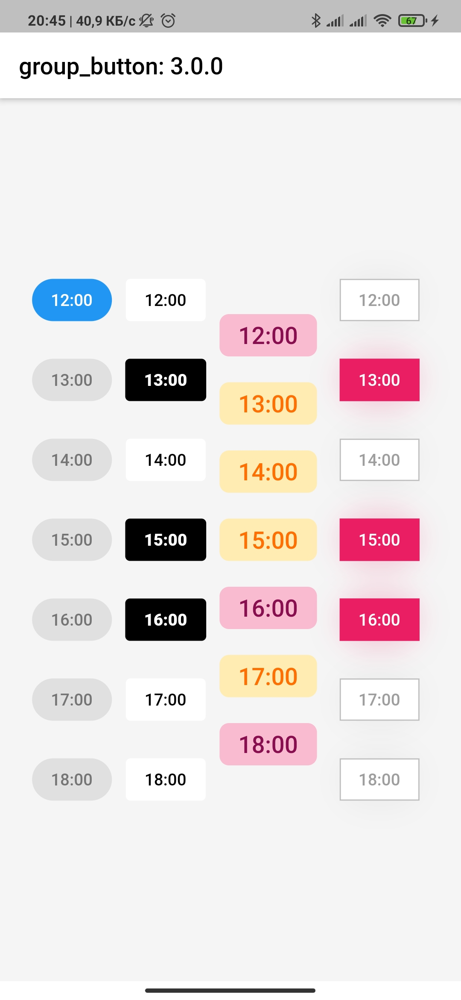
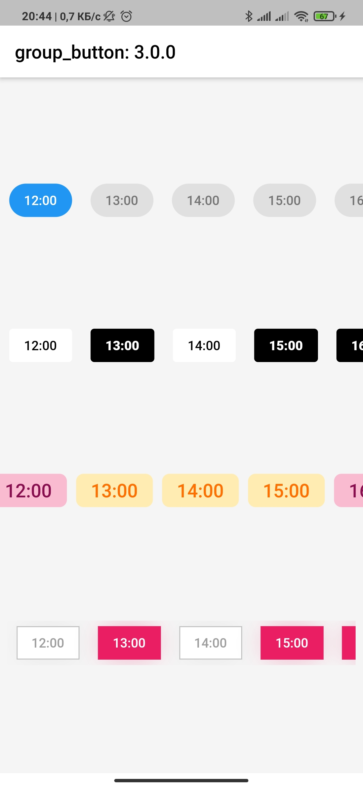

<div align="center">
  
</div>
<h2 align="center">Flutter widget to create a group of buttons fast 🚀</h2>
<p align="center">
   Included Radio and CheckBox buttons models with custom groping types 🤤
   <br>
   <span style="font-size: 0.9em"> Show some ❤️ and <a href="https://github.com/Frezyx/group_button">star the repo</a> to support the project! </span>
</p>
<br>

<p align="center">
<!--   <a href="https://travis-ci.com/Frezyx/group_button"></a> -->
  <a href="https://pub.dev/packages/group_button"></a>
  <a href="https://github.com/Frezyx/group_button"></a>
  <a href="https://opensource.org/licenses/MIT"></a>
</p>
<p align="center">
  <a href="https://pub.dev/packages/group_button/score"></a>
  <a href="https://pub.dev/packages/group_button/score"></a>
  <a href="https://pub.dev/packages/group_button/score"></a>
</p>

|  |  |  | 
| :------------: | :------------: | :------------: |


## Getting Started
Follow these steps to use this package

### Add dependency

```yaml
dependencies:
  group_button: ^3.3.1 #latest version
```

### Add import package

```dart
import 'package:group_button/group_button.dart';
```

### Easy to use
Simple example of use GroupButton<br>
Put this code in your project at an screen and learn how it works 😊

```dart
GroupButton(
    isRadio: false,
    spacing: 10,
    onSelected: (index, isSelected) => print('$index button is selected'),
    buttons: ["12:00", "13:00", "14:30", "18:00", "19:00", "21:40"],
)
```

### Can't easier to use
Now you can use even simpler constructors to build your button groups. <br>
Example for a group with a single value selection
```dart
GroupButton.radio(
  buttons: ['12:00', '13:00', '14:00'],
  onSelected: (i) => debugPrint('Button $i selected'),
)
```

Example for a group with a choice of multiple values
```dart
GroupButton.checkbox(
  buttons: ['12:00', '13:00', '14:00'],
  onSelected: (i, selected) => debugPrint('Button $i selected: $selected'),
)
```

### Controller
**Starting from version 4.0.0** <br>
You can control your Group Button using the controller

```dart
final controller = GroupButtonController();

Column(
  children: [
    GroupButton.checkbox(
      controller: controller,
      buttons: ['12:00', '13:00', '14:00'],
      onSelected: (i, selected) => debugPrint('Button #$i $selected'),
    ),
    TextButton(
      onPressed: () => controller.selectIndex(1),
      child: const Text('Select 1 button'),
    )
  ],
),
```

### Customize
In order to customize your buttons inside *GroupButton* you can use code below</br>
This code includes *all* the fields used in *GroupButton*

```dart
GroupButton(
  controller: GroupButtonController(),
  spacing: 5,
  isRadio: false,
  groupingType: GroupingType.wrap,
  direction: Axis.horizontal,
  onSelected: (index, isSelected) => debugPrint(
    '$index button is ${isSelected ? 'selected' : 'unselected'}',
  ),
  buttons: const [
    "Dart",
    "Kotlin",
    "Java",
    "Swift",
    "Objective-C",
    "Python",
    "JS",
    "C#",
    "C",
    "C++"
  ],
  selectedButtons: const [1, 2, 3],
  selectedTextStyle: const TextStyle(
    fontWeight: FontWeight.w600,
    fontSize: 16,
    color: Colors.red,
  ),
  unselectedTextStyle: TextStyle(
    fontWeight: FontWeight.w600,
    fontSize: 14,
    color: Colors.grey[600],
  ),
  selectedColor: Colors.white,
  unselectedColor: Colors.grey[300],
  selectedBorderColor: Colors.red,
  unselectedBorderColor: Colors.grey[500],
  borderRadius: BorderRadius.circular(5.0),
  selectedShadow: const <BoxShadow>[BoxShadow(color: Colors.transparent)],
  unselectedShadow: const <BoxShadow>[BoxShadow(color: Colors.transparent)],
  buttonHeight: 30,
  buttonWidth: 115,
);
```

### Examples

You can check more examples of using this package [here](example/lib)

<br>
<div align="center" >
  <p>Thanks to all contributors of this package</p>
  <a href="https://github.com/Frezyx/group_button/graphs/contributors">
    
  </a>
</div>
<br>

For help getting started with 😍 Flutter, view
[online documentation](https://flutter.dev/docs), which offers tutorials, 
samples, guidance on mobile development, and a full API reference.


